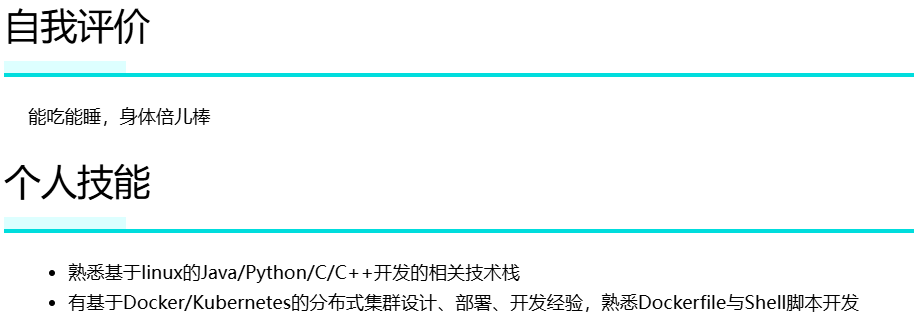

# 别名功能
别名功能的意图是提升简历的自定义程度，允许对标题进行重命名，且复用原有模板。
## 示例
以**获奖经历**为例，若想利用获奖经历模板，但撰写的内容是**论文发表经历**，则可以如下地改写：
```markdown
## [论文发表经历](获奖经历)
### 读者意林
- 时间：2024.07.23
### 知乎故事会
- 时间：2024.07.23
```
这样，渲染出来的结果：


此外，对于同一种模板，也是可以复用的，譬如下面的内容：
```markdown
## [自我评价](个人技能)
能吃能睡，身体倍儿棒
## 个人技能
- 熟悉基于linux的Java/Python/C/C++开发的相关技术栈
- 有基于Docker/Kubernetes的分布式集群设计、部署、开发经验，熟悉Dockerfile与Shell脚本开发
```
渲染结果：
